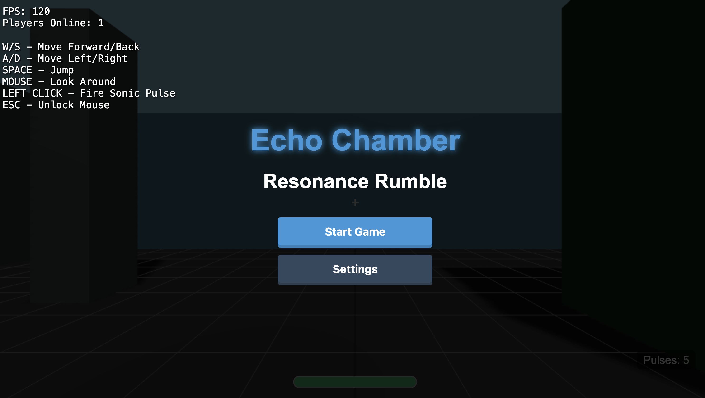

# Echo Chamber: Resonance Rumble (In development!)

A multiplayer FPS where sound is both your weapon and your enemy. Players wield sonic rifles that fire pulses, which grow deadlier with each bounce. Every shot reveals your position to opponents who can track the noise.


<div align="center">
<h1><a href="https://game.ethanbleier.com">Play online here!</a></h1>
</div>





## Game Overview

Echo Chamber: Resonance Rumble is a unique FPS focused on sound mechanics:
- **Sonic Pulses**: Shots gain power with each bounce off surfaces
- **Material Interaction**: Different materials affect sound propagation (metal amplifies, glass shatters for big boosts, soft surfaces dampen)
- **Sound Tracking**: Every shot creates visible sound waves that opponents can see and hear
- **Stealth vs Aggression**: Choose your playstyle - quiet stalking or loud, chaotic combat

## Features

- **Real-time Multiplayer**: Play with friends over WebSockets
- **Dynamic Sound Visualization**: See sound waves propagate through the environment
- **Physics-Based Gameplay**: Calculate ricochets for trick shots around corners
- **Material-Based Environment**: Strategic use of different surfaces for tactical advantage
- **Cross-Platform Play**: Works on any modern browser, performs great on firefox
- **No mobile support**: I'm working on it!

## Quick Start

### Prerequisites
- Python 3.7+ for the WebSocket server

#### Modern web browser 
- Chrome and Firefox are best 
- Safari caps fps at 60

### Installation

1. Clone the repository:
   ```
   git clone https://github.com/ethanbleier/echo.git
   cd echo
   ```

2. Install Python dependencies:
   ```
   pip install -r requirements.txt
   ```

3. Start the WebSocket server:
   ```
   python server.py
   ```

4. Serve the frontend files:
   ```
   cd echo-chamber-frontend
   python -m http.server 8000
   ```

5. Open your browser and navigate to:
   ```
   http://localhost:8000
   ```

## Game Controls

- **WASD**: Movement
- **Mouse**: Look around
- **Left Click**: Fire sonic pulse
- **Space**: Jump
- **ESC**: Unlock mouse cursor

## Game Mode Concepts (TODO)

- **Resonance Deathmatch** (4-8 players): Free-for-all with trick shots and sound tracking
- **Echo Hunt** (2v2 or 3v3): Team-based objective mode with a sound-emitting beacon
- **Amplify King** (6 players): King of the Hill with sonic amplification in the central zone

## Technical Details

### Architecture

The game is split into two main components:

1. **Python WebSocket Server**
   - Handles player connections and disconnections
   - Broadcasts player positions (10 updates per second)
   - Manages game state (player health, sonic pulses)
   - Handles respawn mechanics

2. **JavaScript Frontend**
   - Three.js for 3D rendering
   - Custom physics for sonic pulse propagation
   - Audio visualization system
   - Network synchronization

### Key Files

- `server.py`: WebSocket server implementation
- `echo-chamber-frontend/src/game/Game.js`: Main game loop and logic
- `echo-chamber-frontend/src/game/SonicPulse.js`: Projectile mechanics
- `echo-chamber-frontend/src/game/World.js`: Environment and material interactions
- `echo-chamber-frontend/src/game/NetworkManager.js`: Client-server communication

## Deployment

### Local Network Play

To allow players on your local network:

1. Find your local IP address
2. Set the `HOST` environment variable:
   ```
   export HOST="0.0.0.0"  # Listen on all interfaces
   ```
3. Share your IP address with players:
   ```
   http://your-local-ip:8000
   ```

### Web Hosting

For hosting on a web server:

1. Set up a reverse proxy for the WebSocket server
2. Configure CORS for your domain
3. Ensure WebSocket connections are properly forwarded

Sample PHP proxy is included in `ws-proxy.php` for shared hosting environments.

## Development

### Adding New Materials

Materials define how sonic pulses interact with surfaces:

```javascript
// Add new material in World.js
this.materials = {
    // ...existing materials...
    newMaterial: {
        color: 0xHEXCODE,
        amplification: 1.2,  // How much pulse damage increases
        absorption: 0.4      // How quickly sound dissipates
    }
};
```

### Creating Custom Maps

To create a new level:

1. Modify `World.js` createTestLevel function
2. Add walls with different materials
3. Configure spawn points in `BotManager.js`

## Troubleshooting

### WebSocket Connection Issues

- Check that the server is running (`python server.py`)
- Verify firewall settings allow connections on port 8765
- For hosted environments, ensure WebSocket proxying is configured correctly

### Performance Problems

If experiencing lag:

1. Disable high-quality sound visualization in settings
2. Reduce game resolution in your browser
3. Close other resource-intensive applications

## Contributing

Contributions are welcome! Please feel free to submit pull requests for:

- New game modes
- Additional materials with unique sound properties
- Performance optimizations
- Bug fixes

## License

This project is licensed under the MIT License - see the LICENSE file for details.

## Credits

   Steak and coffee