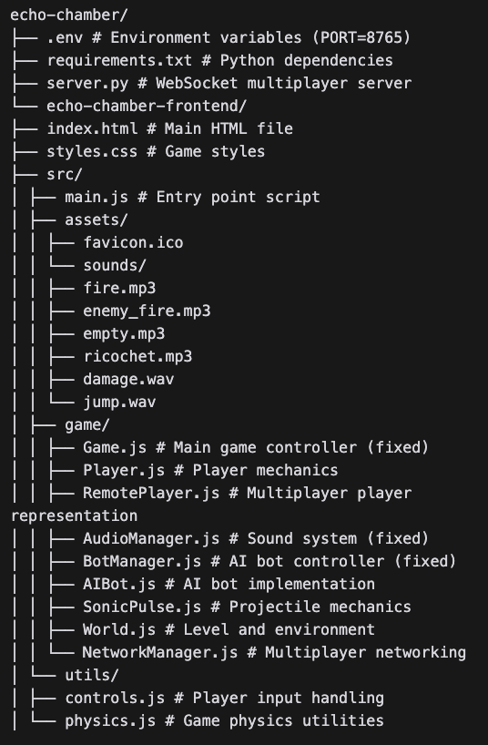

# Echo Chamber: Resonance Rumble

A multiplayer FPS where sound is both your weapon and your enemy. Players wield sonic rifles that fire pulses, which grow deadlier with each bounce. Every shot reveals your position to opponents who can track the noise.

## Game Overview

Echo Chamber: Resonance Rumble is a unique FPS focused on sound mechanics:
- Sonic pulses gain power with each bounce off walls
- Different materials affect sound propagation (metal amplifies, soft surfaces dampen)
- Stealth and sound tracking are key tactical elements

## Setup Instructions

### Prerequisites
- Python 3.7+ for the WebSocket server
- Modern web browser (Chrome, Firefox, Edge)
- Basic knowledge of running terminal commands

### Installation

1. Clone the repository:
   ```
   git clone <your-repository-url>
   cd echo-chamber
   ```

2. Install Python dependencies:
   ```
   pip install -r requirements.txt
   ```

3. Configure environment variables (optional):
   - Create a `.env` file in the root directory
   - Add `PORT=8765` or your preferred port number

### Running the Game

1. Start the WebSocket server:
   ```
   python server.py
   ```
   You should see a message: "Echo Chamber multiplayer server started on port 8765"

2. Serve the frontend files using a simple HTTP server:
   ```
   cd echo-chamber-frontend
   python -m http.server 8000
   ```
   Or use any other HTTP server of your choice.

3. Open your browser and navigate to:
   ```
   http://localhost:8000
   ```

4. To play with others on your local network, they can connect to your IP address:
   ```
   http://<your-ip-address>:8000
   ```

## Game Controls

- **WASD**: Movement
- **Mouse**: Look around
- **Left Click**: Fire sonic pulse
- **Space**: Jump
- **ESC**: Unlock mouse cursor

## Troubleshooting

### Game crashes after a few seconds
If you see infinite animation errors in the console, make sure you're using the fixed versions of:
- Game.js
- BotManager.js
- AudioManager.js

These files have been modified to prevent memory leaks and properly handle animations.

### Cannot connect to multiplayer
- Ensure the WebSocket server is running (python server.py)
- Check your firewall settings to allow connections on ports 8765 and 8000
- Verify that your .env file has the correct PORT setting if you changed it

### Sound not working
The game uses fallback sounds if it can't load audio files. To add your own sounds:
1. Create a directory at `echo-chamber-frontend/src/assets/sounds/`
2. Add the following sound files:
   - fire.mp3
   - enemy_fire.mp3
   - empty.mp3
   - ricochet.mp3
   - damage.wav
   - jump.wav

## Game Modes

- **Resonance Deathmatch**: Classic free-for-all (4-8 players)
- **Echo Hunt**: Team-based objective mode (2v2 or 3v3)
- **Amplify King**: King of the Hill with sonic amplification (6 players)

## Development Notes

### File Structure




### Key Files
- `server.py`: WebSocket server for multiplayer
- `Game.js`: Main game logic
- `AudioManager.js`: Sound system and visualizations
- `BotManager.js`: AI opponents logic
- `World.js`: Level and environment handling
- `SonicPulse.js`: Projectile mechanics

### Known Issues
- Bot spawning may sometimes conflict with walls
- Mobile devices are not fully supported
- Some sound effects may not load in certain browsers

## Contributing

Contributions are welcome! Feel free to submit pull requests or open issues for bugs and feature requests.

## License

This project is licensed under the MIT License - see the LICENSE file for details.
=======
# echo


 A multiplayer FPS where sound is both your weapon and your enemy. Players wield sonic rifles that fire pulses, which grow deadlier with each bounce, but every shot reveals your position to opponents who can track the noise. It’s a mix of stealth, strategy, and chaotic shootouts in tight, reflective arenas. 

 --

## Core Mechanics

  * Sonic Arsenal: Everyone starts with a base sonic rifle. Pulses deal low damage on direct hits (say, 20HP), but each bounce off a wall or object adds power (up to 100HP after 3-4 ricochets). You aim for trick shots—banking pulses around corners or through tunnels—to catch foes off guard.

   * Sound Tracking: Every shot emits a visible soundwave (a faint ripple on-screen) and an audible ping that enemies can hear. Skilled players can pinpoint your location by sound alone, so firing is a calculated risk. Silence is your shield.

  * Environmental Play: Maps are littered with materials that affect pulses—metal walls amplify damage and range, glass shatters for one-time big booms, and soft surfaces (like moss or curtains) dampen shots entirely. Players learn the terrain to dominate.

## Multiplayer Modes

   *  Resonance Deathmatch (4-8 players): Free-for-all chaos. Most kills in 10 minutes wins. Maps are small, with crisscrossing corridors and reflective surfaces to encourage wild ricochet plays. Quiet players stalk, loud ones brawl—your style decides your fate.
   
  * Echo Hunt (2v2 or 3v3): Team-based elimination. One team starts with a “beacon” (a pulsing objective that emits faint noise). Defenders protect it while attackers use sound cues to locate and destroy it. First to three wins. Stealth versus aggression in tense rounds.
  * 
  * Amplify King (6 players): King of the Hill with a twist—a central zone boosts your sonic pulses’ power and range while you hold it. Everyone hears your shots louder, making you a target. Hold the zone longest without dying to win, balancing offense and defense.

## Extra Flavor

  * Upgrades & Gadgets: Scavenge in-match for mods like a “mute shot” (one silent pulse), a decoy emitter (throws fake sound elsewhere), or a high-frequency burst (short-range AOE stun). Keeps matches dynamic.
    
  * Audio Cues: Headphones are king—3D sound design lets you hear shots and footsteps with eerie precision. A good player can “see” the map through sound alone.

  * Maps: Think industrial labyrinths, abandoned concert halls, or crystal caves—places where sound bounces and distorts. Maybe a map with a central gong that, if shot, deafens everyone for 10 seconds (chaos ensues).